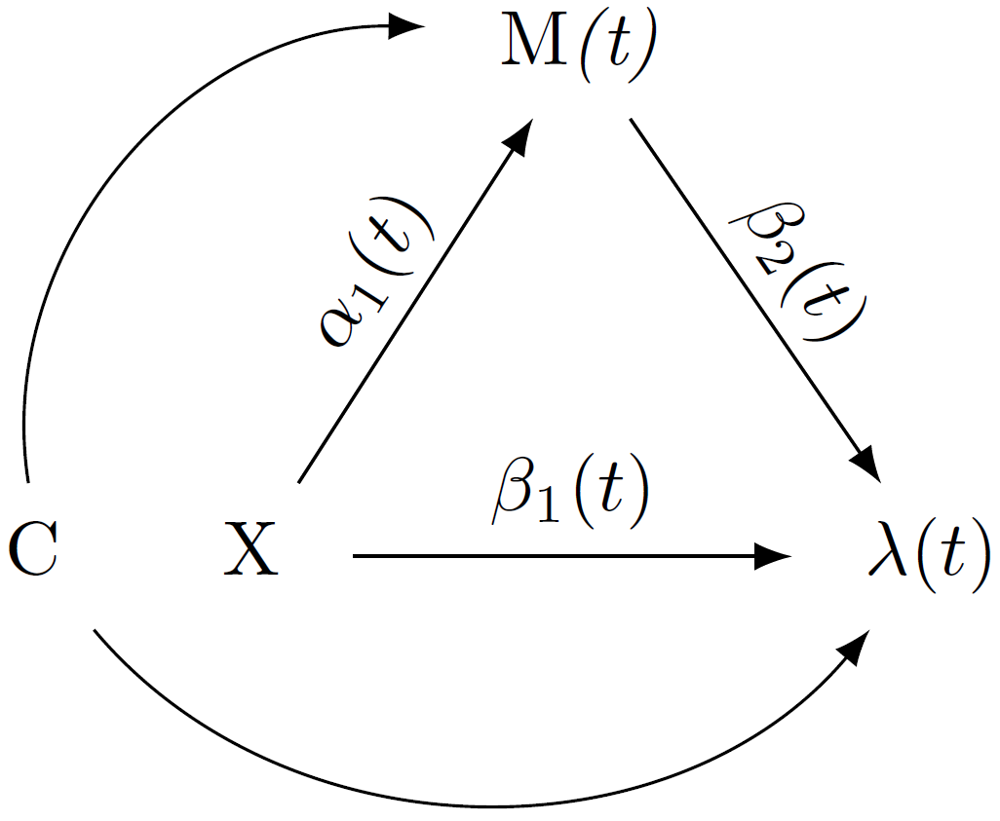

<style>
.main-container {
  max-width: unset;
}
</style>

```{r, include = FALSE}
knitr::opts_chunk$set(
  collapse = TRUE,
  comment = "#>"
)
```

```{r setup}
library(dpasurv)
```

## 1. Introduction

Dynamic path analysis introduced by [@fosen] is a method for performing mediation analysis with a longitudinal mediator and time-to-event outcome. A thorough review of the methodology can be found in the tutorial paper of [@dpasurv]. In this vignette we will outline the modeling framework and define direct, indirect and total effects in the context of dynamic path analysis. We then demonstrate the the main functionalities of the \textit{dpasurv} package, namely estimation, inference, and visualization.

## 2. Methods 

### Dynamic path analysis

Dynamic path analysis involves modeling so-called *dynamic path diagrams* such as the one depicted in Figure 1. A dynamic path diagrams is defined in [@fosen] as a time-indexed sequence of directed acyclic graphs that is characterized by a treatment variable, $\small X$, one or more longitudinal mediator variables, $\small M(t)$, and a survival (time-to-event) outcome with hazard $\small \lambda(t)$ that takes the role of a single terminal node in the dynamic path diagram. Additional time-fixed confounder variables, such as baseline characteristics, $\small C$, may be incorporated as well. 

```{r, out.width = "200px", include=TRUE, fig.align="center", echo=FALSE, fig.cap="Figure 1. A simple dynamic path diagram with treatment $\\small X$, a single mediator $\\small M(t)$, and confounders $\\small C$."}

```

Relationships between variables are represented by directed edges between nodes and collectively the nodes and edges imply an underlying model structure. More specifically, each child node represents an entity to be modeled while the corresponding parent nodes represent the underlying model covariates. In Figure 1 there are two implied models, one corresponding to the hazard $\small \lambda(t)$ of the time-to-event outcome, and the other corresponding to the mediator response $\small M(t)$.

A defining feature of dynamic path analysis as defined in [@fosen] is the specific choice of models for the dynamic path diagram, namely the so-called *dynamic path models*. At the core of these is Aalen's additive regression model for the survival outcome at the terminal node while all other models involve least squares regressions at each time point $t$. In the following equations we see the dynamic path models corresponding to Figure 1:
\begin{align}
\lambda(t) &= R(t) \cdot \left\{\beta_0(t) + \beta_1(t) X + \beta_2(t) M(t) + C\eta \right\},  \tag{1} \\
M(t) &= \alpha_0(t) + \alpha_1(t) X + C\eta + \varepsilon(t).  \tag{2}
\end{align}
In the above $\small R(t)$ is the *at-risk* function indicating whether subject is still under observation (i.e. alive and still under follow up) just before time $\small t$, and $\small \varepsilon(t)$ is a time-dependent error term. Under the *outcome model* (1) the hazard is assumed to change linearly as a function of treatment, mediator(s) and confounders, while in the *mediator model* (2) the longitudinal mediator is regressed on treatment and confounders.

The regression functions of principal interest are those characterizing the relationships between treatment, mediator(s) and survival, namely $\small \beta_1(t), \beta_2(t)$, and $\small \alpha_1(t)$. The goal of dynamic path analysis (and the `dpasurv` package) is to estimate these key functions that serve as building blocks for the direct, indirect and total effects that are defined in the next section.

### Direct, indirect and total effects

The cumulative direct and indirect effects at time $t$ are defined as as follows:
\begin{align}
cumdir(t) &= \int_0^t \beta_1(s)ds \label{eqn:direct_effect}, \\
cumind(t) &= \int_0^t \alpha_1(s)\beta_2(s)ds \label{eqn:indirect_effect}.
\end{align}
The total effect is defined as the regression function $\gamma_1(t)$ from the mediator free Aalen's additive model:
$$
\lambda(t) = R(t) \cdot \left\{\gamma_0(t) + \gamma_1(t) X + C\eta \right\}, \tag{3}
$$
and the corresponding cumulative total effect is defined as:
\begin{align}
cumtot(t) &= \int_0^t \gamma_1(s)ds \label{eqn:total_effect}. \\
\end{align}
One of the most appealing features of dynamic path analysis is the following analytical decomposition:
$$
cumtot(t) = cumdir(t) + cumind(t)
$$

### Estimation and inference

The analytical estimators for the cumulative direct, indirect, and total effects above are derived in [@dpasurv] and confidence bands are obtained by bootstrap inference. More specifically, we repeatedly sample subjects with replacement from the set of all subjects and estimate the direct, indirect and total effects each time. Once we have obtained $B$ bootstrap estimates of the effects of interest, i.e. $(\widehat{cumdir}_b(t), \widehat{cumind}_b(t), \widehat{cumtot}_b(t)$), for $b=1,\dots,B$, then we calculate pointwise $100\cdot(1-\alpha)$\% bootstrap confidence intervals at each timepoint $t$ by calculating the corresponding empirical $100\cdot\alpha/2$ and $100\cdot(1-\alpha/2)$ percentiles.

## 3. Implementation

The `dpasurv` package implements the complete dynamic path analysis workflow. 

### Fitting the dynamic path model

The following code fits a dynamic path model aimed at evaluating potential mediation of the effect of treatment `x` through a longitudinal mediator `M`.
```{r}
set.seed(1)
s <- dpa(survival::Surv(start, stop, event) ~ M + x, list(M ~ x), id = "subject", data = simdata, boot.n = 500)
```

### Estimating direct, indirect and total effects

Once the dynamic path models have been fitted, the user can extract direct and indirect effects with the `effect()` function
```{r, eval=FALSE}
direct <- effect(x ~ outcome, s, alpha=0.05)
indirect <- effect(x ~ M ~ outcome, s, alpha=0.05)
```
The outputs above (`direct` and `indirect`) are both objects of class `"effect"` and they can be summed together via the `sum` method to obtain the total effect
```{r, eval=FALSE}
total <- sum(direct, indirect)
```
### Plotting effects

The `plot` method for objects of class `"effect"` can be used to quickly visualize the estimated effects along with confidence bands.
```{r, eval=FALSE, fig.width=7, fig.height=4}
par(mfrow=c(1,3))
plot(direct); abline(h=0, lty=2, col=2)
plot(indirect); abline(h=0, lty=2, col=2)
plot(total); abline(h=0, lty=2, col=2)
```
Alternatively, the user may plot all of the effects in a single plot using ggplot2 graphics:
```{r, eval=FALSE, fig.width=7, fig.height=4}
par(mfrow=c(1,3))
ggplot.effect(list(direct, indirect, total))
```
See the ggplot_demo.html vignette for further details.
