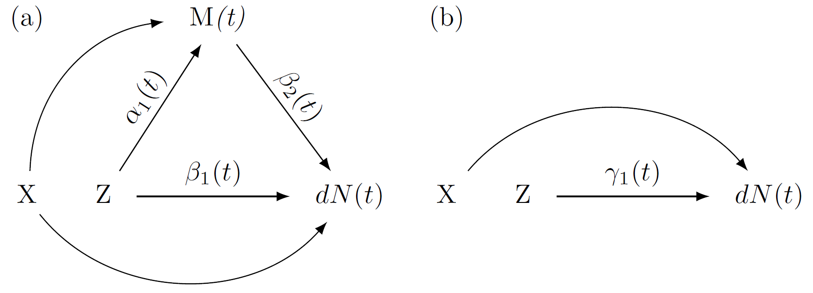

<style>
.main-container {
  max-width: unset;
}
</style>

```{r, include = FALSE}
knitr::opts_chunk$set(
  collapse = TRUE,
  comment = "#>"
)
```

```{r setup}
library(dpasurv)
library(ggplot2)
```

## 1. Introduction

Dynamic path analysis introduced by [@fosen] is a method for performing mediation analysis with a longitudinal mediator and time-to-event outcome. A thorough review of the methodology can be found in the tutorial paper of [@dpasurv]. In this vignette we will outline the modeling framework and define direct, indirect and total effects in the context of dynamic path analysis. We then demonstrate the the main functionalities of the \textit{dpasurv} package, namely estimation, inference, and visualization.

## 2. Methods 

### Dynamic path analysis

Dynamic path analysis involves modeling so-called *dynamic path diagrams* such as the one depicted in Figure 1 (a). A dynamic path diagram is defined in [@fosen] as a time-indexed sequence of directed acyclic graphs that is characterized by a treatment variable, $\small Z$, one or more longitudinal mediator variables, $\small M(t)$, and a survival (time-to-event) outcome $\small dN(t)=1(t \leq T < t+dt)$, where $\small T$ denotes the time of event with hazard $\small \lambda(t) = \lim_{dt \rightarrow 0} P(dN(t)=1 | T \geq t)$. The survival outcome takes the role of a single terminal node in the dynamic path diagram. Additional time-fixed confounder variables, such as baseline characteristics, $\small X$, may be incorporated as well. 

```{r, out.width = "630px", include=TRUE, fig.align="center", echo=FALSE, fig.cap="Figure 1. (a) A dynamic path diagram with treatment $\\small Z$, a single mediator $\\small M(t)$, and baseline confounders $\\small X$; (b) Corresponding dynamic path diagram without the mediator process."}

```

Relationships between variables are represented by directed edges between nodes and collectively the nodes and edges imply an underlying model structure. More specifically, each child node represents an entity to be modeled while the corresponding parent nodes represent the underlying model covariates. In Figure 1 (a) there are two implied models, one corresponding to the survival outcome variable, $\small dN(t)$, and the other corresponding to the mediator response $\small M(t)$.

A defining feature of dynamic path analysis as defined in [@fosen] is the specific choice of models for the dynamic path diagram, namely the so-called *dynamic path models*. At the core of these is Aalen's additive regression model for the survival outcome at the terminal node while all other models involve least squares regressions at each time point $\small t$. In the following equations we see the dynamic path models corresponding to Figure 1 (a)
\begin{align}
\lambda(t) &= R(t) \cdot \left\{\beta_0(t) + \beta_1(t) Z + \beta_2(t) M(t) + X\eta \right\},  \tag{1} \\
M(t) &= \alpha_0(t) + \alpha_1(t) Z + X\eta + \varepsilon(t).  \tag{2}
\end{align}
In the above $\small R(t)$ is the *at-risk* function indicating whether subject is still under observation (i.e. alive and still under follow up) just before time $\small t$, and $\small \varepsilon(t)$ is a time-dependent error term. Under the *outcome model* (1) the hazard is assumed to change linearly as a function of treatment, mediator(s) and confounders, while in the *mediator model* (2) the longitudinal mediator is regressed on treatment and confounders.

The regression functions of principal interest are those characterizing the relationships between treatment, mediator(s) and survival, namely $\small \beta_1(t), \beta_2(t)$, and $\small \alpha_1(t)$. The goal of dynamic path analysis (and the dpasurv package) is to estimate these key functions that serve as building blocks for the direct, indirect and total effects that are defined in the next section.

### Direct, indirect and total effects

The cumulative direct and indirect effects at time $\small t$ are defined as as follows
\begin{align}
cumdir(t) &= \int_0^t \beta_1(s)ds \label{eqn:direct_effect}, \\
cumind(t) &= \int_0^t \alpha_1(s)\beta_2(s)ds \label{eqn:indirect_effect}.
\end{align}
The direct effect corresponds to the regression function along the direct arrow between treatment $\small Z$ and outcome $\small dN(t)$ in Figure 1 (a), while the indirect effect is obtained by multiplying the regression functions along the mediation path $\small Z \rightarrow M(t) \rightarrow dN(t)$.

The total effect is defined as the regression function $\small \gamma_1(t)$ from the mediator free Aalen's additive model from Figure 1 (b)
$$
\lambda(t) = R(t) \cdot \left\{\gamma_0(t) + \gamma_1(t) Z + X\eta \right\}, \tag{3}
$$
and the corresponding cumulative total effect is defined as:
\begin{align}
cumtot(t) &= \int_0^t \gamma_1(s)ds \label{eqn:total_effect}. \\
\end{align}
One of the most appealing features of dynamic path analysis is the following analytical decomposition
$$
cumtot(t) = cumdir(t) + cumind(t).
$$

### Estimation and inference

The analytical estimators for the cumulative direct, indirect, and total effects above are derived in [@dpasurv] and confidence bands are obtained by bootstrap inference. More specifically, we repeatedly sample subjects with replacement from the set of all subjects and estimate the direct, indirect and total effects each time. Once we have obtained $\small B$ bootstrap estimates of the effects of interest, i.e. $\small (\widehat{cumdir}_b(t), \widehat{cumind}_b(t), \widehat{cumtot}_b(t)$), for $\small b=1,\dots,B$, then we calculate pointwise $\small 100\cdot(1-\alpha)$\% bootstrap confidence intervals at each timepoint $\small t$ by calculating the corresponding empirical $\small 100\cdot\alpha/2$ and $\small 100\cdot(1-\alpha/2)$ percentiles.

## 3. Getting started with dpasurv

The dpasurv package implements the complete dynamic path analysis workflow. 

### Simulated data set

The dpasurv package comes with a simulated data set called `simdata`
```{r}
simdata
```
The data contains the following variables:

* *subject:* Subject ID
* *x:* Binary treatment covariate (0 for control, 1 for treated)
* *dose:* Underlying dose (ctrl, low, high)
* *M:* Longitudinal mediator measurement
* *start:* Visiting times at which the mediator value is measured
* *stop:* Time that either marks the beginning of the next visit, or censoring (if event=0). Alternatively it marks the time of event (if event=1)
* *event:* Binary event indicator

At each visiting time, start, a new mediator measurement is taken. However, the mathematical assumption is that the intervals (start,stop] are open on the left and closed on the right, which means that the value of the mediator M for subject 1 at week 4 is taken to be `r simdata$M[simdata$subject==1 & simdata$stop==4]`. Under this assumption the risk of an event in the interval (start, stop] is influenced by the last observed mediator value.

### Implementation in a nutshell

Below we see the minimal code required for performing dynamic path analysis on `simdata`. It explores the direct effect of x on survival as well as the indirect effect mediated through M:
```{r, eval=FALSE}
# Perform dynamic path analysis
s <- dpa(Surv(start, stop, event) ~ M + x, list(M ~ x), id = "subject", data = simdata, boot.n = 500)

# Extract cumulative direct and indirect effects with 95% pointwise bootstrap confidence bands:
direct <- effect(x ~ outcome, s, alpha=0.05)
indirect <- effect(x ~ M ~ outcome, s, alpha=0.05)

# Use sum() method to obtain total effect
total <- sum(direct, indirect)

# Plot the results
par(mfrow=c(1,3))
plot(direct); abline(h=0, lty=2, col=2)
plot(indirect); abline(h=0, lty=2, col=2)
plot(total); abline(h=0, lty=2, col=2)

# Plot the results with ggplot2 graphics:
ggplot.effect(list(direct, indirect, total))
```

## 4. Simulated Use Case

Let us now use the dpasurv package to perform a slightly more in depth analysis of `simdata`.

### Look at the data

Firstly, we note that there is a dose response trend when looking at longitudinal trends in the subject mediator profiles:
```{r, message=FALSE, warning=FALSE, fig.width=5}
ggplot(mapping=aes(x = start, y = M, group=dose, colour=dose), data=simdata) + geom_smooth()
```

The higher the dose, the higher the average mediator value is. 

We also note that there is a dose response trend when looking at association between dose levels and survival
```{r, fig.width=5}
fit <- survival::survfit(Surv(start, stop, event) ~ dose, data=simdata)
plot(fit, col=1:3, xlab="Time", ylab="Survival", main="KM-curves by dose level")
legend(150, 1, c("control", "low dose", "high dose"),
col=1:3, lwd=2, bty='n')
```

A Cox model with dose and mediator as covariates reveals a significant hazard ratio for high dose, but only a trend for the low dose (both as compared to control), while there is no significant association between the mediator and survival:
```{r}
summary(coxph(Surv(start, stop, event) ~ dose + M, data=simdata))
```

### Dynamic path analysis

Let's now perform dynamic path analysis with the `dpa()` function
```{r}
set.seed(1)
s <- dpa(Surv(start, stop, event) ~ M + dose, list(M ~ dose), id = "subject", data = simdata, boot.n = 500)
```
and calculate some effects of interest with the `effect()` function.

We confirm a dose response on mediator, which appears significant for the high-dose vs control:
```{r}
# The dose effect on mediator response:
dose.on.mediator <- effect(dose ~ M, s)

ggplot.effect(dose.on.mediator)
```

We also confirm a dose response on survival outcome, although only the high-dose appears significant:
```{r}
# direct effect of dose on outcome
direct <- effect(dose ~ outcome, s)

ggplot.effect(direct)
```

In contrast to the conclusions from the Cox-model there appears to be a meaningful dynamic association between the mediator and survival:
```{r}
# effect of mediator on outcome
mediator.on.outcome <- effect(M ~ outcome, s)

ggplot.effect(mediator.on.outcome)
```

In particular, the mediator effect is neutral for the first 100 days and then starts having a significant detrimental effect on survival after that (the higher the mediator value, the higher the risk). 

### Explore output of Aalen's additive model

The output object from the call to the `dpa()` function above stores the output from Aalen's additive model (1) and we can explore its content for inferential purposes
```{r}
# Output from Aalen's additive model from the timereg::aalen() implementation:
summary(s$aalen)
```

According to the resampling tests of the time-varying effects we see that the mediator effect is indeed significantly different from zero as well as the high-dose effect, while the low-dose effect is only marginally significant.

### Plot the direct, indirect, and total effects

Finally, let's also calculate the indirect and total effects
```{r}
# indirect effect of dose on outcome, mediated through M
indirect <- effect(dose ~ M ~ outcome, s)

# total effect
total <- sum(direct, indirect)
```
and then plot together the direct, indirect, and total effects:
```{r, fig.width=7}
ggplot.effect(list(direct, indirect, total))
```

We see that the indirect effect of dose on survival is neutral for the first 100 days but then becomes detrimental for survival after that (only significant for the high dose). The detrimental indirect effect of the high dose counteracts the corresponding significant and beneficial direct effect.
